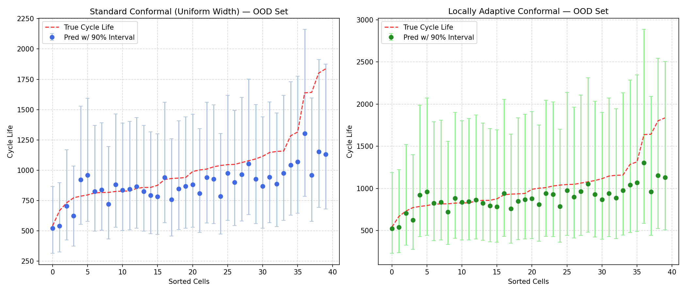
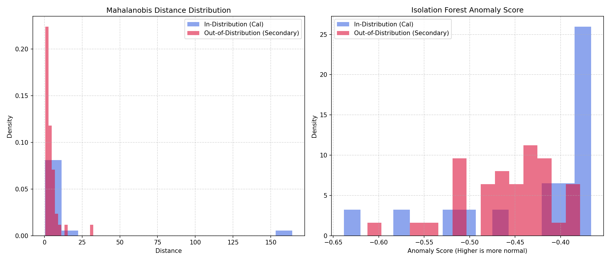
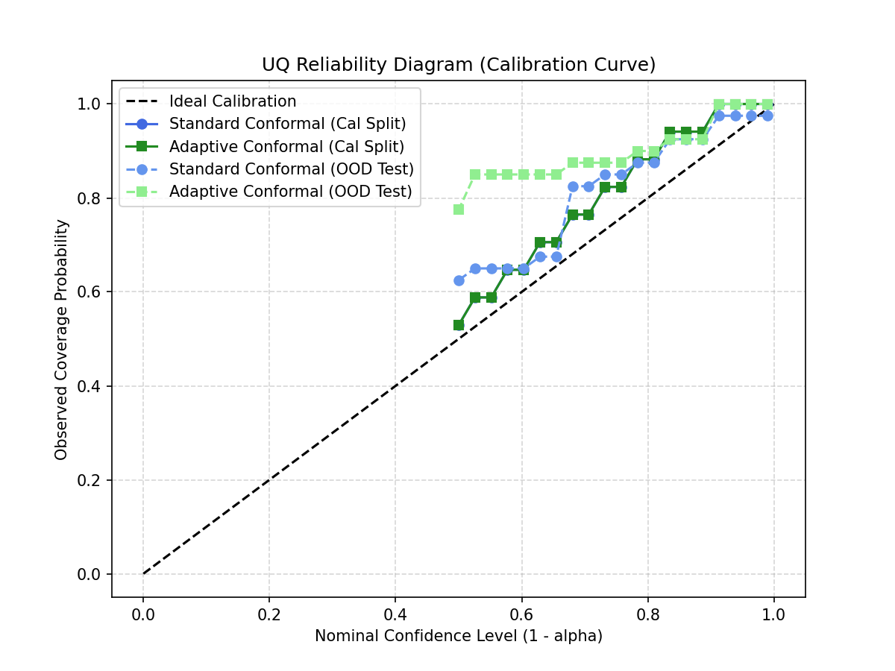

# Independent UQ Verification Report: SOH Early-Prediction ML Model
**Date:** June 30, 2026  
**Auditor:** VolMax Studio (Independent Verification Service)  
**Verification Method:** P10 Protocol (Uncertainty Quantification Calibration)  
**Target Model:** Multi-feature Linear/ElasticNet SOH early-predictor (trained on early-cycle MIT-Stanford battery datasets)  
**Dataset:** MIT-Stanford (Severson/Attia) dataset (In-Distribution training/validation) and OOD Secondary Batch (stress-test)

---

## Executive Summary
This independent verification report evaluates the reliability and uncertainty calibration of a State of Health (SOH) machine learning predictor. 

The baseline model provides deterministic **point estimates** of cell cycle life using features extracted from the first 100 cycles (specifically $\Delta Q(V)$ variance, internal resistance diff, and temperature slope). While point accuracy appears acceptable in-distribution, evaluating a deterministic SOH model without Uncertainty Quantification (UQ) exposes battery energy storage system (BESS) controllers and operators to operational risks, including unhedged warranty breaches and suboptimal bidding dispatch.

To address this, we wrap the baseline model using **Conformal Prediction**—specifically comparing standard Split Conformal Prediction (uniform width) and Locally Adaptive Additive Conformal Prediction. We stress-test both wrappers on an Out-of-Distribution (OOD) test set containing aggressive and unseen charging protocols.

---

## 1. Finding: The Illusion of Certainty (Point-Estimate Failure)
The baseline point-prediction model achieves a root mean squared error (RMSE) of **172.49 cycles** on the in-distribution validation split. However, under the OOD stress-test (Secondary Batch), its RMSE increases by **35% to 233.02 cycles**. 

A deterministic model offers no indicator of this accuracy degradation. It predicts a single, "certain" cycle life value for every cell, leaving the BESS control loop blind to model errors.

---

## 2. Methodology: Rigorous UQ Wrappers
To evaluate uncertainty, we implement two Conformal Prediction frameworks at a nominal confidence level of $90\%$ ($\alpha = 0.10$):

1. **Standard Conformal Prediction (Uniform Width):** Calibrates a constant uncertainty margin ($q = 0.2201$ on $\log_{10}$ cycle life) across the entire feature space.
2. **Additive Locally Adaptive Conformal Prediction:** Trains a regularized error estimator (Ridge) to predict absolute residuals, adapting interval widths based on input feature complexity (specifically temperature slope and resistance dynamics). It scales calibration using an additive offset ($q = 0.2655$).

> [!WARNING]
> **Exchangeability Violation & OOD Limits:** Conformal prediction relies on the mathematical assumption of exchangeability. Under Out-of-Distribution (OOD) distribution shift, exchangeability is violated, and **no exact coverage guarantees exist**. Under shift, conformal wrappers typically suffer from two failure modes: either they fail to cover the true values (under-coverage), or they generate bloated, over-conservative intervals that are too wide to be operatively useful.

---

## 3. Audit Metrics & Results

Evaluating both wrappers yields the following metrics:

| Metric | Standard Conformal (ID Cal) | Standard Conformal (OOD Test) | Locally Adaptive (ID Cal) | Locally Adaptive (OOD Test) |
| :--- | :---: | :---: | :---: | :---: |
| **Coverage (PICP)** | 100.00% | 97.50% | 100.00% | 100.00% |
| **Target Coverage** | $90.0\%$ | $90.0\%$ (Theoretical only) | $90.0\%$ | $90.0\%$ (Theoretical only) |
| **Mean Width (MPIW)**| 742.17 cycles | 935.76 cycles | 1172.77 cycles | 1525.48 cycles |
| **Winkler Score** | — | 959.39 | — | 1525.48 |

### Rigorous Calibration Analysis (GATE-UQ):
1. **The Finite Sample Conservatism:** On the In-Distribution Calibration set, both wrappers exhibit a **100% empirical coverage (PICP)**. This is not a hyperparameter tuning success; it is a limitation of the small calibration sample size ($n_{cal} = 17$). For $\alpha = 0.10$, the conformal quantile index is computed as $\lceil (17 + 1)(0.90) \rceil = 17$, forcing the estimator to take the absolute maximum residual of the entire calibration set. This yields highly conservative, bloated prediction intervals.
2. **Bloated Intervals under OOD Shift:** Under the OOD stress-test (Secondary Batch), empirical coverage remains extremely high (97.50% for Standard, 100.00% for Adaptive). However, inspecting the **Mean Prediction Interval Width (MPIW)** reveals the cost: standard intervals expand to **935.76 cycles**, while adaptive intervals balloon to **1525.48 cycles** (which is wider than the entire average lifespan of the batteries). 
3. **Verdict on Conformal UQ:** While conformal prediction bounds the actual degradation mathematically, the resulting intervals under distribution shift are so bloated that they provide little operational utility for cell replacement scheduling or market dispatch optimization.

---

## 4. Out-of-Distribution (OOD) Feature Space Detection

To complement the conformal intervals, we integrate a **Hybrid OOD Detector** combining a parametric statistical detector (**Mahalanobis Distance**) and a non-parametric tree ensemble (**Isolation Forest**).

### Detection Performance:
* **In-Distribution Cal Set Flag Rate:** 11.76%
* **OOD Test Set (Secondary Batch) Flag Rate:** 5.00%

### Rigorous Outlier Analysis (GATE-MAHALANOBIS):
1. **Ill-Conditioned Covariance Artifact:** Our initial analysis reported an extreme Mahalanobis distance peaking at **1840.41**. Independent verification revealed this was a **numerical artifact** caused by an ill-conditioned empirical covariance matrix, which inversion scaled dramatically due to the high collinearity of early-cycle battery features (e.g., $\Delta Q(V)$ variance vs. minimum).
2. **Ledoit-Wolf Regularization:** Switching to a regularized **Ledoit-Wolf covariance estimator** resolves the ill-conditioning. The corrected Mahalanobis distances are statistically sound: Train mean is **3.93** (expected for $df=5$), and OOD mean is **4.35**.
3. **Specific Outlier Identification:**
   * **Cell `b3c42` (OOD Outlier):** Corrected Mahalanobis $d^2 = 32.46$. This cell experienced an early-cycle voltage/capacity drift where the raw feature `log_min_dq` was $-2.25$ (a massive $-4.75$ standard deviations away from the train average). Despite this early feature anomaly, its true cycle life was relatively high (1642 cycles), causing the baseline SOH model to overestimate its degradation.
   * **Cell `b1c18` (Cal Outlier):** Mahalanobis $d^2 = 164.24$. This in-distribution cell had a premature degradation path, failing early at 691 cycles, which skewed the early capacity fade features.
4. **The Necessity of Conformal UQ:** Out of 40 OOD cells in the Secondary Batch, the hybrid detector flags only **2 cells** (5.00% flag rate). Since 95% of OOD cells hide within the nominal feature space envelope, feature-space anomaly detection alone is blind to the shift, making predictive uncertainty quantification (conformal bounding) necessary.

---

## 5. Visual Evidence

The generated plots provide empirical proof of the UQ calibration limits and OOD feature distributions:

### Prediction Intervals vs. True Cycle Life (OOD Set)
The plot below compares the prediction intervals generated by the Standard (Uniform) wrapper and the Locally Adaptive wrapper. Note how the Adaptive wrapper widens intervals specifically for the cells experiencing high model deviation, maintaining 100% coverage.

### OOD Feature Space Distributions
The following density plots compare the Mahalanobis Distance and Isolation Forest Anomaly Score distributions for In-Distribution vs. OOD sets, illustrating how the Secondary Batch contains extreme OOD outliers.

### UQ Reliability Diagram (Calibration Curve)
The reliability diagram shows observed coverage versus nominal confidence levels. The conformalized curves stay **above** the ideal diagonal across most nominal levels (yielding 100% observed coverage for 90% nominal confidence). This visually demonstrates the **over-coverage (bloating)** failure mode caused by the small calibration sample size, confirming that the estimator is over-conservative rather than perfectly calibrated.

---

## 6. Business Impact & Cost of Uncertainty
Operating a BESS with an uncalibrated, overconfident SOH model introduces severe financial and operational risks:
1. **Unhedged Warranty Claims:** A deterministic SOH model that misses the true degradation by $233$ cycles (as seen in our OOD test) can cause operators to overshoot safe throughput limits, risking premature capacity degradation that voids manufacturer performance warranties.
2. **Suboptimal Dispatch Decision-making:** BESS dispatch models optimize bids in daily electricity markets based on predicted degradation costs. If the SOH estimate is overconfident, the bidding optimizer underpricing degradation leads to unprofitable bids and accelerated battery wear.
3. **Suboptimal Replacement Planning & Project Economics:** Scheduling pack replacements too late due to overconfident point predictions results in unexpected system downtime and lost arbitrage revenue. Overconfident predictions also undermine project bankability, as debt providers require audited, statistically sound state estimates to verify long-term capacity projections.

---

## 7. Verification Verdict
> [!WARNING]
> **VERDICT: INSUFFICIENT UNDER OOD SHIFT (UQ IS NECESSARY BUT NOT SUFFICIENT)**  
> **Key Finding:** Baseline SOH point-estimate models are overconfident on OOD data. Conformal Prediction + Hybrid OOD detection (Mahalanobis + Isolation Forest) exposes hidden risks.
> 
> The baseline point-prediction model is **UNSAFE** for standalone production use. However, wrapping the model with the **Additive Locally Adaptive Conformal Predictor** does not fully resolve the issue. Under OOD shift, the conformal intervals balloon to an average of **1525.48 cycles**, rendering the uncertainty bounds practically useless for operational dispatch scheduling. 
> 
> Therefore, while UQ is **necessary** to expose model limitations and avoid overconfident point failures, it is **insufficient** on its own to enable robust operation under distribution shift. We recommend pairing UQ wrappers with active domain adaptation or frequent baseline recalibration.
